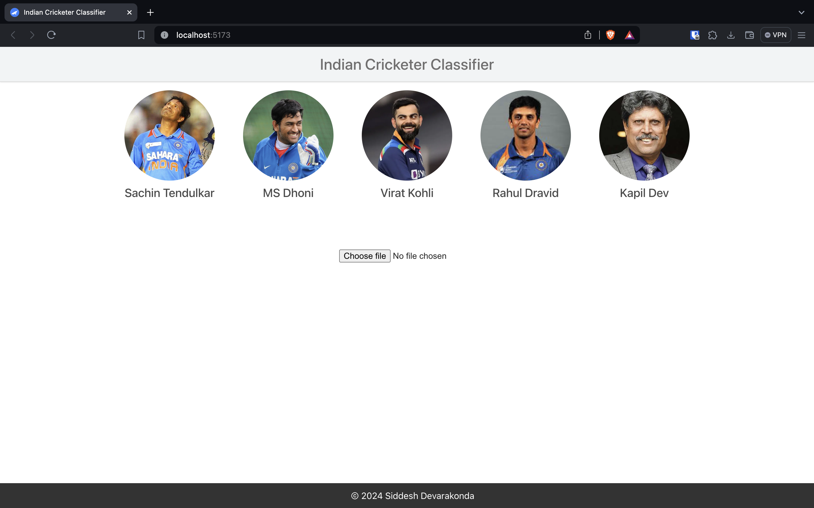
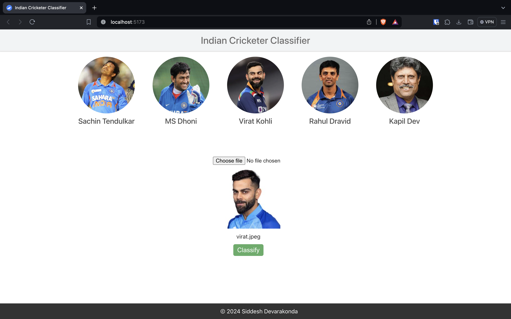
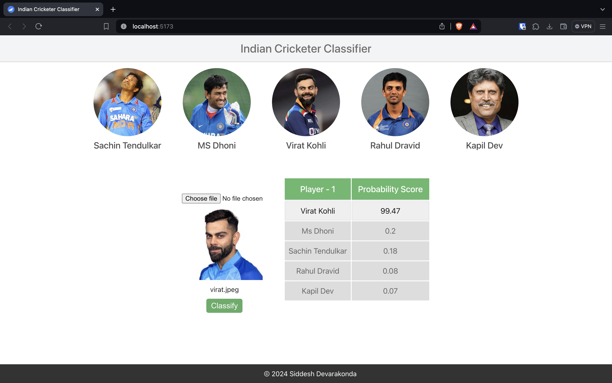
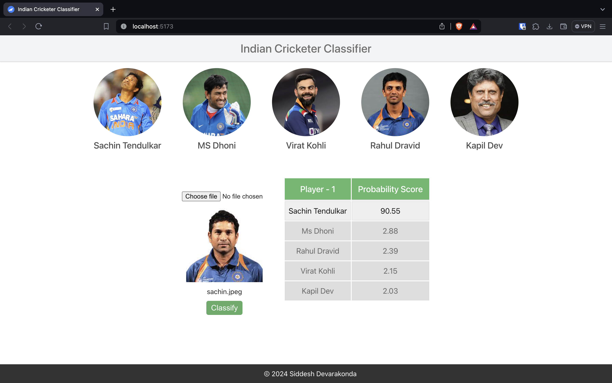

### Project Description

- It is an End-to-End Web Application to classify given cricketer image and outputs the name of the person.
- Model is trained on 5 classes: Sachin Tendulkar, MS Dhoni, Virat Kohli, Rahul Dravid, Kapil Dev.
- Model will return the probability of each class and the class with highest probability is the output.

### Demo Pictures

-  Initial Page



- After Uploading Image



- After Classifying Image



- Classifying another Image



### Setup

```bash
pip install -r requirements.txt
```

```bash
npm install # node version 20.8.0
```

### Run

Run the following commands in separate terminals
```bash
cd ui
npm run dev
```

```bash
cd server
uvicorn server:app --reload
```